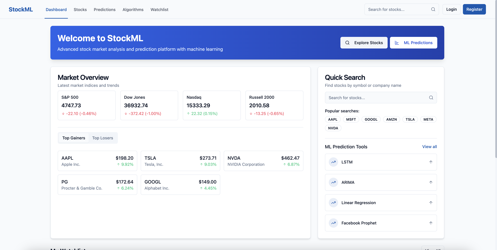
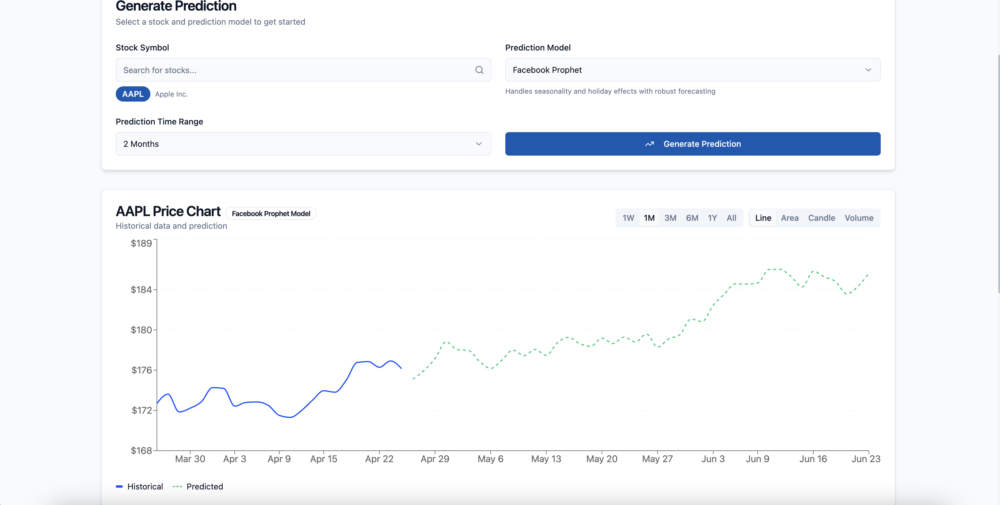

# 📈 TrendPilot — Stock Market Prediction & Analysis Platform


> ⚡ A beautiful, fully responsive web app that lets users analyze and predict stock prices using advanced machine learning algorithms. Built for tech-savvy investors, data lovers, and curious minds!

---

## 🚀 Features

✅ Stunning UI/UX with Tailwind CSS & React  
✅ Real-time & historical stock market data  
✅ Multiple ML models: **LSTM**, **ARIMA**, **Linear Regression**, **Prophet**  
✅ Interactive graphs, charts & model performance visualizations  
✅ Transparent algorithm breakdowns and explanations  
✅ User authentication (JWT / Firebase)  
✅ Save watchlists and download prediction reports  
✅ Fully responsive, mobile-friendly, and lightning fast!

---

## 🧠 Machine Learning Algorithms Used

| Algorithm         | Purpose                          | Tools Used          |
|------------------|----------------------------------|---------------------|
| LSTM              | Time-series forecasting          | TensorFlow/Keras    |
| ARIMA             | Statistical modeling             | statsmodels         |
| Linear Regression | Simple predictive modeling       | Scikit-learn        |
| Prophet           | Trend/cycle-based forecasting    | Facebook Prophet    |

📌 Each algorithm includes:
- Visualized predictions
- Performance metrics (RMSE, MAE, etc.)
- Transparent, user-friendly explanations

---

## 📸 Screenshots

> *(Add screenshots from your app in `/public/images` and link them here)*




---

## 🛠️ Tech Stack

**Frontend**:  
- React.js  
- Tailwind CSS  
- Vite

**Backend**:  
- Node.js + Express.js  
- MongoDB

**ML Microservice**:  
- Python (Flask / FastAPI)  
- Deployed via Render or Hugging Face Spaces

---

## 📦 Setup Instructions

### 🔧 Prerequisites

- Node.js & npm
- Python 3.8+
- MongoDB account
- GitHub or Vercel account (for deployment)

### 💻 Frontend

```bash
cd frontend
npm install
npm run dev
